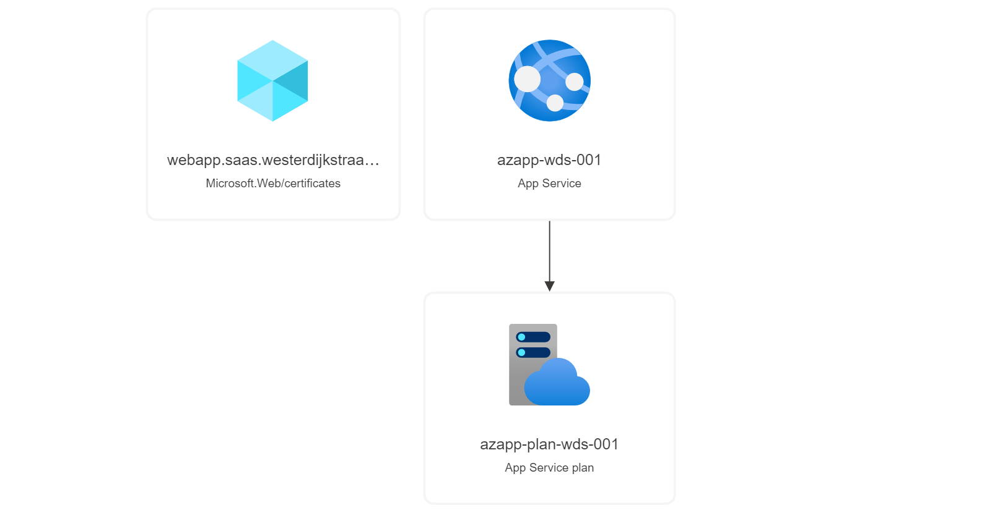

# Webapp Deployment

Deploy an App Service Plan with a single web app.

If you enter a custom DNS name, this will create a managed certificate and bind it to the application
**This will not create the DNS records required by the certificates**

this will first create a disabled Hostname Binding (If required CNAME records exist)

then create the certificate in the App Service Plan and finally use SNI to bind the certificate

